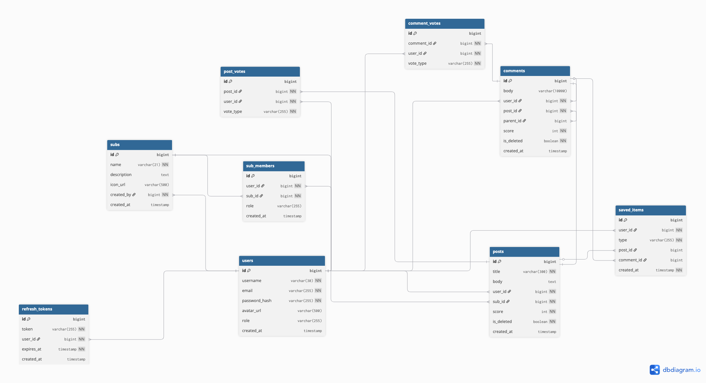

    Table users {
    id bigint [pk, increment]
    username varchar(30) [unique, not null]
    email varchar(255) [unique, not null]
    password_hash varchar(255) [not null]
    avatar_url varchar(500)
    role varchar(255) [note: 'USER, MODERATOR, ADMIN']
    created_at timestamp

        indexes {
        username [name: 'idx_user_username']
        email [name: 'idx_user_email']
        }
    }

    Table subs {
        id bigint [pk, increment]
        name varchar(21) [unique, not null]
        description text
        icon_url varchar(500)
        created_by bigint [not null]
        created_at timestamp

        indexes {
        name [name: 'idx_sub_name']
        }
    }

    Table sub_members {
        id bigint [pk, increment]
        user_id bigint [not null]
        sub_id bigint [not null]
        role varchar(255) [default: 'Member', note: 'Member, Moderator']
        created_at timestamp

        indexes {
        (user_id, sub_id) [unique]
        sub_id [name: 'idx_sub_member_sub']
        }
    }

    Table posts {
        id bigint [pk, increment]
        title varchar(300) [not null]
        body text
        user_id bigint [not null]
        sub_id bigint [not null]
        score int [not null, default: 0]
        is_deleted boolean [not null, default: false]
        created_at timestamp

        indexes {
        user_id [name: 'idx_post_user']
        sub_id [name: 'idx_post_sub']
        created_at [name: 'idx_post_created_at']
        }
    }

    Table comments {
        id bigint [pk, increment]
        body varchar(10000)
        user_id bigint [not null]
        post_id bigint [not null]
        parent_id bigint [note: 'self-ref for nesting']
        score int [not null, default: 0]
        is_deleted boolean [not null, default: false]
        created_at timestamp

        indexes {
        post_id [name: 'idx_comment_post']
        created_at [name: 'idx_comment_created_at']
        }
    }

    Table post_votes {
        id bigint [pk, increment]
        post_id bigint [not null]
        user_id bigint [not null]
        vote_type varchar(255) [not null, note: 'UPVOTE, DOWNVOTE']

        indexes {
        (post_id, user_id) [unique]
        }
    }

    Table comment_votes {
        id bigint [pk, increment]
        comment_id bigint [not null]
        user_id bigint [not null]
        vote_type varchar(255) [not null, note: 'UPVOTE, DOWNVOTE']

        indexes {
        (comment_id, user_id) [unique]
        }
    }

    Table saved_items {
        id bigint [pk, increment]
        user_id bigint [not null]
        type varchar(255) [not null, note: 'POST, COMMENT']
        post_id bigint
        comment_id bigint
        created_at timestamp [not null]

        indexes {
        (user_id, post_id) [unique]
        (user_id, comment_id) [unique]
        user_id [name: 'idx_saved_item_user']
        }
    }

    Table refresh_tokens {
        id bigint [pk, increment]
        token varchar(255) [unique, not null]
        user_id bigint [not null]
        expires_at timestamp [not null]
        created_at timestamp

        indexes {
        token [name: 'idx_refresh_token_token']
        user_id [name: 'idx_refresh_token_user']
        }
    }

    // Relationships
    Ref: subs.created_by > users.id
    Ref: sub_members.user_id > users.id
    Ref: sub_members.sub_id > subs.id
    Ref: posts.user_id > users.id
    Ref: posts.sub_id > subs.id
    Ref: comments.user_id > users.id
    Ref: comments.post_id > posts.id
    Ref: comments.parent_id > comments.id
    Ref: post_votes.user_id > users.id
    Ref: post_votes.post_id > posts.id
    Ref: comment_votes.user_id > users.id
    Ref: comment_votes.comment_id > comments.id
    Ref: saved_items.user_id > users.id
    Ref: saved_items.post_id > posts.id
    Ref: saved_items.comment_id > comments.id
    Ref: refresh_tokens.user_id > users.id
# Database Schema
## users
| Column | Type | Constraints |
|--------|------|-------------|
| id | bigint | PK, auto increment |
| username | varchar(30) | unique, not null |
| email | varchar(255) | unique, not null |
| password_hash | varchar(255) | not null |
| avatar_url | varchar(500) | |
| karma | int | default: 0 |
| created_at | timestamp | default: now() |

## sub
| Column | Type | Constraints |
|--------|------|-------------|
| id | bigint | PK, auto increment |
| name | varchar(21) | unique, not null |
| description | text | |
| icon_url | varchar(500) | |
| created_by | bigint | not null, FK → users.id |
| created_at | timestamp | default: now() |

## sub_members
| Column | Type | Constraints |
|--------|------|-------------|
| id | bigint | PK, auto increment |
| user_id | bigint | not null, FK → users.id |
| subreddit_id | bigint | not null, FK → sub.id |
| role | varchar(20) | default: 'member' (member, moderator) |
| created_at | timestamp | default: now() |

**Unique:** (user_id, subreddit_id)

## posts
| Column | Type | Constraints |
|--------|------|-------------|
| id | bigint | PK, auto increment |
| title | varchar(300) | not null |
| type | varchar(10) | not null (text, link, image) |
| body | text | |
| url | varchar(2000) | |
| image_url | varchar(500) | |
| user_id | bigint | not null, FK → users.id |
| subreddit_id | bigint | not null, FK → sub.id |
| score | int | default: 0 |
| is_deleted | boolean | default: false |
| created_at | timestamp | default: now() |

## comments
| Column | Type | Constraints |
|--------|------|-------------|
| id | bigint | PK, auto increment |
| body | text | not null |
| user_id | bigint | not null, FK → users.id |
| post_id | bigint | not null, FK → posts.id |
| parent_comment_id | bigint | FK → comments.id (self-ref for nesting) |
| score | int | default: 0 |
| is_deleted | boolean | default: false |
| created_at | timestamp | default: now() |

## post_votes
| Column | Type | Constraints |
|--------|------|-------------|
| id | bigint | PK, auto increment |
| user_id | bigint | not null, FK → users.id |
| post_id | bigint | not null, FK → posts.id |
| value | smallint | not null (1 = upvote, -1 = downvote) |
| created_at | timestamp | default: now() |

**Unique:** (user_id, post_id)

## comment_votes
| Column | Type | Constraints |
|--------|------|-------------|
| id | bigint | PK, auto increment |
| user_id | bigint | not null, FK → users.id |
| comment_id | bigint | not null, FK → comments.id |
| value | smallint | not null (1 = upvote, -1 = downvote) |
| created_at | timestamp | default: now() |

**Unique:** (user_id, comment_id)

## saved_items
| Column | Type | Constraints |
|--------|------|-------------|
| id | bigint | PK, auto increment |
| user_id | bigint | not null, FK → users.id |
| post_id | bigint | FK → posts.id |
| comment_id | bigint | FK → comments.id |
| created_at | timestamp | default: now() |

**Unique:** (user_id, post_id), (user_id, comment_id)